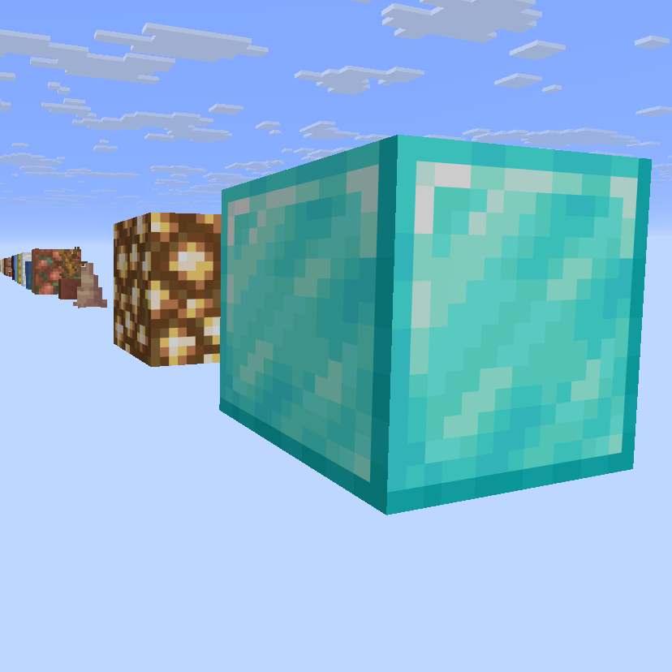

# GridBlock

An infinite, self-repairing line of random blocks stretching through the void — every block is deterministic from the world seed, and if you break one the exact same block returns instantly.

## Features

- **Infinite & deterministic** — the block at every position is a pure function of its coordinates and the world seed. Identical every load, unique per world.
- **Self-repairing** — break any block and the same one reappears the next tick.
- **1072 blocks** — the palette is generated straight from the game's block registry, not a hand-picked handful.
- **No falling blocks** — sand, gravel, anvils and the like levitate instead of dropping into the void.
- **Datapack only** — no mods. Works in single-player and on servers.

## Installation

### New world

1. Download `gridblock.zip`.
2. Launch Minecraft **Java 26.2** and click **Singleplayer → Create New World**.
3. Open the **More** tab → **Data Packs**.
4. Drag `gridblock.zip` onto the window → click **Yes** on the prompt.
5. Click the pack's arrow to move it into the right (**Selected**) column.
6. Click **Create New World** — the pack turns the Default world type into an empty void automatically.
7. You spawn on a soul-soil block with a line of blocks running forward. Break one and it returns instantly.

### Existing world

1. Edit the world → **Open World Folder**.
2. Drop `gridblock.zip` into the `datapacks` folder.
3. Run `/reload` in-game.

> Only builds correctly in a **void** world.

### Server

Put `gridblock.zip` in `world/datapacks`, then run `/reload`.

## Requirements

Minecraft **Java 26.2** (pack format 107).

## License

MIT
